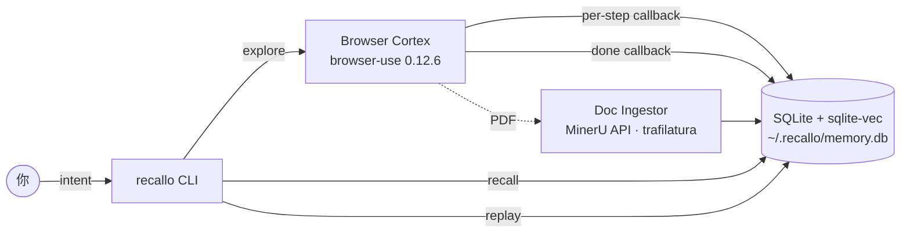

# Recallo

[](https://github.com/TianqBu/recallo/actions/workflows/ci.yml)
[](LICENSE)
[](pyproject.toml)

**Languages:** [English](README.md) · 简体中文

> 给你的浏览器 Agent 一份能查得到、改得了、删得掉的记忆。
> 本地优先(local-first)的浏览器 Agent,带长期记忆,主打论文阅读场景。

Recallo 会浏览 arxiv(或任何你给的 URL),解析它看到的内容,把所有东西
写进 `~/.recallo/` 下的本地 SQLite 文件。下次你问「那篇 Self-RAG 的论文
关于检索说了啥来着?」,它直接从你过去的会话里答出来 —— 不联网、不重新提问。

```text
$ recallo explore "Open arxiv 2310.11511 and summarize the Self-RAG abstract"
[recallo] launching browser-use agent...
  [0] navigate         https://arxiv.org/abs/2310.11511
  [1] extract_content  Self-RAG: Learning to Retrieve, Generate, and Critique...
  [2] done             3 step(s), 2 fact(s) extracted
[recallo] episode 6e6c4710 stored

# ...关掉终端,明天再来...

$ recallo recall "what did that paper say about retrieval?"
[recallo] mode=semantic
- [extract] Self-RAG uses self-reflection tokens to decide when to retrieve  (d=0.214)
- [extract] On-demand retrieval improves factuality vs. always-retrieve baselines  (d=0.231)
```

差异点在第二条命令:**不走任何网络**就能回答 —— Recallo 直接从你硬盘上
的 `~/.recallo/memory.db` 读,断网也能用。

> **状态**: pre-alpha —— 下面的四个命令都能跑、有测试,但 v0.2 之前
> 仍可能有粗糙的边角和不兼容改动。

## 为什么强调本地优先?

ChatGPT Atlas、Comet 之类的「AI 浏览器」把你的浏览记忆存在它们的
服务器上。Recallo 把记忆留在你机器里 `~/.recallo/memory.db`
—— 一个 SQLite 文件,你能自己看、自己备份、自己分享、自己删掉。

## 快速开始

```bash
# Recallo 还没发到 PyPI,直接从 GitHub 装
pip install git+https://github.com/TianqBu/recallo.git

recallo init                           # 创建 ~/.recallo/memory.db
recallo explore "Summarize arxiv:2310.11511"
# ...过段时间再回来...
recallo recall "what did that Self-RAG paper say about retrieval?"
# 不想花 embedding 钱时,强制用 FTS5 关键词检索:
recallo recall "self rag" --mode keyword
# 看历史所有 episode,然后用 git 风格的 id 前缀深入某一次:
recallo replay
recallo replay 6e6c4710
```

### 配置 LLM Provider

Recallo 是 BYOK(Bring Your Own Key)。任选其一:

```bash
export OPENAI_API_KEY=sk-...
export ANTHROPIC_API_KEY=sk-ant-...
# 或者本地跑 Ollama,什么 key 都不用配
```

### 可选: 用 MinerU 做高质量 PDF 解析

如果要解析学术 PDF 全文(图、表、公式),在另一个终端起 MinerU
的 HTTP 服务:

```bash
pip install "mineru[pipeline]"
# 国内用户:走 ModelScope 镜像下载模型更快
export MINERU_MODEL_SOURCE=modelscope
mineru-models-download
mineru-api --host 127.0.0.1 --port 8000
```

如果 `mineru-api` 没启,Recallo 会先 fallback 到 `trafilatura`,
再 fallback 到 arxiv 摘要页。

> Recallo 的 PDF 解析能力来自 [MinerU](https://github.com/opendatalab/MinerU)。

## Windows 注意事项

- Recallo 保留默认的 `ProactorEventLoop`,**不要**强行改成 Selector
  (Selector 循环不支持 `create_subprocess_exec`,browser-use 启不了 Chromium)
- 如果 Chrome 装在非默认路径,设
  `BROWSER_USE_BROWSER_PATH=C:\Path\To\chrome.exe`

## 它怎么工作



三张表(`episodes`、`traces`、`facts`)、一个 FTS5 索引、一个可选的
`vec0` 虚拟表。所有东西都在一个 SQLite 文件里 —— 没有 daemon、
没有 Docker、没有 Postgres。

## 存了些什么

一个 SQLite 文件,三张主表 + 两个索引:

- `episodes` —— 每次任务一行,记录意图、状态、摘要
- `traces` —— 每一步浏览器动作的记录(动作类型、URL、选择器、文本片段)
- `facts` —— 从页面抽出来的内容,由 done-callback 写入
- `facts_fts` —— `facts` 上的 FTS5 关键词索引(M1 兜底)
- `fact_vec` —— sqlite-vec 虚拟表,1536 维浮点向量(M2)

完整 schema 见 `recallo/schema.sql`。

### 召回模式

设了 `OPENAI_API_KEY` 时,`recallo recall` 会把你的 query 做 embedding,
然后在 `fact_vec` 上跑 kNN。没设 key 时,自动 fallback 到 `facts_fts` 的
FTS5 关键词搜索。用 `--mode keyword` 或 `--mode semantic` 强制锁模式。

## 隐私设计

Recallo 不会把任何东西上传到 Recallo 自己的服务器(但 LLM 和 embedding
的请求当然还是会发到你配置的那个 provider —— OpenAI / Anthropic / 本地
的 Ollama)。本地的几道防线:

- **域名黑名单** —— 银行、网页邮箱、医疗门户、私聊
  (WhatsApp/Telegram/Messenger/Discord)、社交私信
  (Twitter/X/Instagram)、协作工具(Notion/Slack)、密码管理器
  在写入 trace 表之前就被丢掉。改 `recallo/safety.py` 可以扩展。
- **URL 脱敏** —— OAuth 风格的查询参数(`access_token`、`code`、
  `session`、`state`、`password`...)以及 URL 片段(fragment)在
  存进 trace 之前就剥掉。
- **密钥脱敏** —— 常见 API key 形态(OpenAI `sk-`、Anthropic
  `sk-ant-`、AWS、Google、GitHub PAT、Slack token、通用 `Bearer …`)
  在写入 episode 摘要、页面标题、agent thinking 之前会被替换成
  `[redacted-secret]`。
- **严格文件权限** —— `~/.recallo/memory.db` 创建时在 POSIX 上是
  `0o600`(Windows 上 chmod 是 no-op,需要更严格隔离的话用 NTFS ACL)。

## Roadmap

- M1 —— 可装的骨架,`init`、`explore` 跑通 browser-use ✅
- M2 —— sqlite-vec 语义 `recall` + FTS5 兜底,从 agent history 抽 fact ✅
- M3 —— 从 GitHub 一行装、release 文档、demo 脚本 ⬅ 当前阶段
  (PyPI 发布管道已搭好,等有理由再占名字)
- M4 —— Memory Replay 时间线 ✅、MinerU 三层 fallback、覆盖更全的测试

## 站在巨人肩膀上

- [browser-use](https://github.com/browser-use/browser-use) —— 浏览器自动化
- [MinerU](https://github.com/opendatalab/MinerU) —— 学术 PDF 解析
- [trafilatura](https://github.com/adbar/trafilatura) —— 兜底文本抽取
- [sqlite-vec](https://github.com/asg017/sqlite-vec) —— 本地向量检索

完整归属信息见 [THIRD_PARTY_LICENSES.md](./THIRD_PARTY_LICENSES.md)。

## 协议

Apache 2.0
